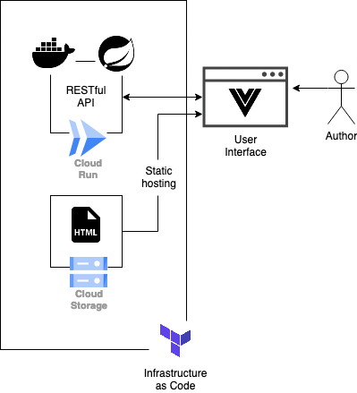

# Storytel Message Board

This repository contains a minimal message board implementation.

## System Design



## Getting Started

Use `make help` for an overview of all commands.

### Starting the server

For development purposes:

- Run the API locally using: `make run`.
- Run the API Dockerized using: `make run-docker-dev`.

For production purposes:

- To start a Dockerized version: `make run-docker-prod`.

### API Usage

Explore the API by inspecting the [OpenAPI definition](http://localhost:8080/swagger-ui/index.html).

### Database

Browse to the [H2 Console](http://localhost:8080/h2-console).
Use:

```
JDBC URL: jdbc:h2:mem:message-board
User Name: admin
```

### UI

Use the browser to open `index.html` while the server is running.

### Google Cloud

To run on Google Cloud one needs:

- A GCP account.
- Google Cloud SDK, e.g., `brew install google-cloud-sdk`.
- Terraform, e.g., `brew install terraform`.

Steps:

```bash
# Log in to Google Cloud.
gcloud auth application-default login

# Create a project, the ID needs to be unique.
# Update `terraform/variables.tf` with the PROJECT_ID used above.
gcloud projects create "message-board123" --name="message-board"

# Build production docker image.
make build-docker-prod

# Push production image to the Google Container registry.
gcloud services enable containerregistry.googleapis.com --project message-board123
gcloud auth configure-docker
docker tag message-board-prod eu.gcr.io/message-board123/message-board
docker push eu.gcr.io/message-board123/message-board

# Move to the folder holding the Terraform configuration files.
cd terraform

# Initialize Terraform configuration.
terraform init

# Plan changes.
terraform plan

# Apply changes (type 'yes' when prompted).
terraform apply

# Change the url in index.html. Plan and apply the changes once more.
# Alternatively, deploy cloud run first, then upload `index.html` to bucket.
terraform plan
terraform apply

# Delete the project when you are done.
terraform destroy
gcloud projects delete message-board123
```

## Next Steps

- Address security issues:
  - Enable CORS.
  - Add authentication.
- Work on UI / UX:
  - Enable build tool for Vue (vs. using from CDN).
  - Add styling.
  - Add edit message functionality.

## Reference Documentation

For reference:

- [Official Spring Boot documentation](https://docs.spring.io/spring-boot/docs/current/reference/htmlsingle/)
- [Official Apache Maven documentation](https://maven.apache.org/guides/index.html)
- [Offical Vue documentation](https://vuejs.org/guide/introduction.html)
